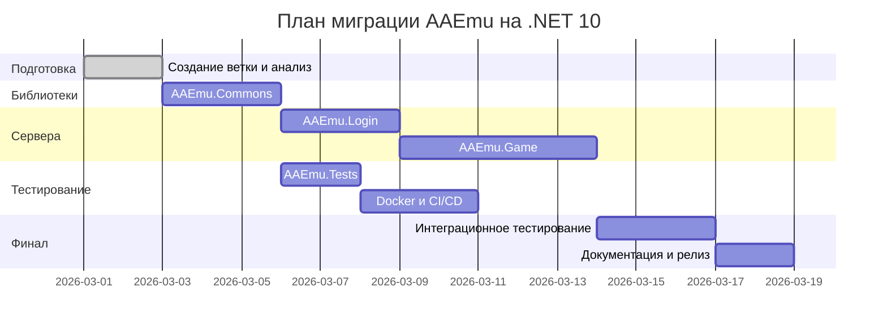

# План миграции AAEmu с .NET Core 3.1 на .NET 10.0

## Executive Summary

Данный документ описывает детальный план миграции проекта AAEmu (эмулятор сервера ArcheAge) с .NET Core 3.1 на .NET 10.0. Миграция охватывает 4 активных проекта в solution, обновление 25+ NuGet пакетов, модернизацию Docker-конфигурации и переход на современные Runtime Identifiers.

**Ключевые изменения:**
- TargetFramework: `netcoreapp3.1` → `net10.0`
- LangVersion: `9.0` → `13.0` (C# 13)
- SDK: `6.0` → `10.0.100` (предварительная версия до релиза .NET 10)
- Runtime Identifiers: удаление устаревших (win7, ubuntu.18.04), добавление современных

---

## 1. Предварительные требования

### 1.1. Инструменты и окружение

| Требование | Минимальная версия | Примечание |
|------------|-------------------|------------|
| .NET SDK | 10.0.100-preview.x | Установить предварительную версию .NET 10 SDK |
| Visual Studio | 2022 17.12+ | Поддержка .NET 10 |
| VS Code | Latest | С расширением C# Dev Kit |
| Docker Desktop | 4.25+ | Для тестирования контейнеров |
| PowerShell | 7.4+ | Для скриптов автоматизации |

### 1.2. Резервное копирование

Перед началом миграции обязательно:
1. Создать Git-ветку `feature/dotnet-10-migration`
2. Убедиться, что все текущие изменения закоммичены
3. Создать тег `before-dotnet-10-migration` на текущем состоянии main
4. Экспортировать базу данных для тестирования

---

## 2. Текущая архитектура и зависимости

### 2.1. Структура решения

```
AAEmu.sln
├── AAEmu.Commons/          # Библиотека общих компонентов
│   ├── TargetFramework: netcoreapp3.1
│   └── Dependencies: MySql.Data, Newtonsoft.Json, NLog, NetCoreServer
├── AAEmu.Game/               # Game Server (Exe)
│   ├── TargetFramework: netcoreapp3.1
│   ├── RuntimeIdentifiers: 18 платформ (устаревшие)
│   └── Dependencies: 15 NuGet пакетов
├── AAEmu.Login/              # Login Server (Exe)
│   ├── TargetFramework: netcoreapp3.1
│   └── Dependencies: Microsoft.Extensions.*, NLog
└── AAEmu.Tests/              # xUnit тесты (Exe)
    ├── TargetFramework: netcoreapp3.1
    └── Dependencies: xUnit 2.4.1, Microsoft.NET.Test.Sdk 15.9.0
```

### 2.2. Текущие Runtime Identifiers (устаревшие)

```xml
win7-x64;win7-x86;win8-x64;win8-x86;win81-x64;win81-x86;
win10-x64;win10-x86;centos.7-x64;debian.9-x64;ubuntu.18.04-x64;
sles-x64;sles.12-x64;sles.12.1-x64;sles.12.2-x64;sles.12.3-x64;
alpine-x64;alpine.3.7-x64
```

**Проблемы:**
- Windows 7/8/8.1 не поддерживаются .NET 10
- CentOS 7 EOL (30 июня 2024)
- Ubuntu 18.04 EOL (31 мая 2023)
- Debian 9 EOL (30 июня 2022)
- SLES 12 EOL (31 октября 2024)

---

## 3. Матрица обновления NuGet пакетов

### 3.1. AAEmu.Commons

| Пакет | Текущая | Целевая | Breaking Changes | Приоритет |
|-------|---------|---------|------------------|-----------|
| MySql.Data | 8.0.13 | 9.2.0 | **ВЫСОКИЙ** - изменения в Authentication | Критический |
| Newtonsoft.Json | 12.0.1 | 13.0.3 | Средний - изменения в JsonSerializerSettings | Высокий |
| NLog | 4.5.11 | 5.3.4 | **ВЫСОКИЙ** - изменения в API логирования | Критический |
| NetCoreServer | 2.0.3 | 8.0.7 | Средний - проверить совместимость | Средний |

### 3.2. AAEmu.Game

| Пакет | Текущая | Целевая | Breaking Changes | Приоритет |
|-------|---------|---------|------------------|-----------|
| Discord.Net | 2.2.0 | 3.16.0 | **ВЫСОКИЙ** - GatewayIntents обязательны | Высокий |
| Jace | 0.9.2 | 1.0.0 | Низкий | Низкий |
| JitterPhysics | 0.2.0.20 | 0.2.0.20 | Заморожен - проверить совместимость | Средний |
| Microsoft.CodeAnalysis.CSharp.Scripting | 2.10.0 | 4.11.0 | **ВЫСОКИЙ** - Roslyn API изменения | Высокий |
| Microsoft.Data.Sqlite | 2.2.1 | 8.0.10 | Средний - SQLitePCLRaw обновление | Средний |
| Microsoft.Extensions.Configuration | 2.2.0 | 8.0.0 | Средний - см. раздел 4.1 | Высокий |
| Microsoft.Extensions.Configuration.Binder | 2.2.0 | 8.0.2 | Средний | Высокий |
| Microsoft.Extensions.Configuration.CommandLine | 2.2.0 | 8.0.0 | Низкий | Высокий |
| Microsoft.Extensions.Configuration.EnvironmentVariables | 2.2.0 | 8.0.0 | Низкий | Высокий |
| Microsoft.Extensions.Configuration.Json | 2.2.0 | 8.0.1 | Средний | Высокий |
| Microsoft.Extensions.DependencyInjection | 2.2.0 | 8.0.1 | **ВЫСОКИЙ** - ValidateScopes по умолчанию | Критический |
| Microsoft.Extensions.Hosting | 2.2.0 | 8.0.1 | Средний | Высокий |
| NLog | 4.5.11 | 5.3.4 | **ВЫСОКИЙ** | Критический |
| NLua | 1.5.6 | 1.7.3 | Средний - зависимость от KeraLua | Средний |
| Quartz | 3.2.3 | 3.13.1 | Средний - JobStore изменения | Средний |
| Ionic.Zlib | 1.9.1.5 | 1.9.1.5 | Legacy - рассмотреть замену | Низкий |
| System.Numerics.Vectors | 4.5.0 | - | **УДАЛИТЬ** - встроено в .NET 5+ | - |

### 3.3. AAEmu.Login

| Пакет | Текущая | Целевая | Breaking Changes | Приоритет |
|-------|---------|---------|------------------|-----------|
| Microsoft.Extensions.* | 2.2.0 | 8.0.x | Средний | Высокий |
| NLog | 4.5.11 | 5.3.4 | **ВЫСОКИЙ** | Критический |
| System.Runtime.Loader | 4.3.0 | - | **УДАЛИТЬ** - встроено в .NET Core 3+ | - |

### 3.4. AAEmu.Tests

| Пакет | Текущая | Целевая | Breaking Changes | Приоритет |
|-------|---------|---------|------------------|-----------|
| coverlet.collector | 1.3.0 | 6.0.2 | Низкий | Средний |
| coverlet.msbuild | 2.9.0 | 6.0.2 | Низкий | Средний |
| Microsoft.NET.Test.Sdk | 15.9.0 | 17.11.1 | Средний - новый формат вывода | Высокий |
| xunit | 2.4.1 | 2.9.2 | Средний - analyzers по умолчанию | Высокий |
| xunit.runner.visualstudio | 2.4.2 | 2.8.2 | Низкий | Высокий |

---

## 4. Breaking Changes по версиям

### 4.1. Microsoft.Extensions 2.2 → 8.0

#### 4.1.1. Dependency Injection (Microsoft.Extensions.DependencyInjection)

**Изменение:** `ValidateScopes` теперь включен по умолчанию в Development окружении.

**Влияние:** При вызове scoped сервисов из singleton может произойти исключение.

**Действие:**
```csharp
// Было (работало в 2.2):
services.BuildServiceProvider();

// Стало:
services.BuildServiceProvider(validateScopes: false); // Не рекомендуется
// ИЛИ правильное использование scope:
using (var scope = serviceProvider.CreateScope())
{
    var service = scope.ServiceProvider.GetRequiredService<IScopedService>();
}
```

#### 4.1.2. Configuration Binder (Microsoft.Extensions.Configuration.Binder)

**Изменение:** `Bind` теперь требует явного указания options для nullable типов.

**Действие:** Проверить все вызовы `configuration.Bind(obj)` на предмет null значений.

#### 4.1.3. Hosting (Microsoft.Extensions.Hosting)

**Изменения:**
- `IHostingEnvironment` устарел, заменен на `IHostEnvironment`
- `ApplicationLifetime` устарел, заменен на `IHostApplicationLifetime`

**Действие:**
```csharp
// Было:
public MyService(IHostingEnvironment env, IApplicationLifetime lifetime)

// Стало:
public MyService(IHostEnvironment env, IHostApplicationLifetime lifetime)
```

### 4.2. NLog 4.5 → 5.3

#### 4.2.1. Изменения в конфигурации

**Breaking Changes:**
- `autoReload` теперь работает только если `throwConfigExceptions="false"`
- Изменен формат дат по умолчанию
- `ArchiveFileName` теперь требует явного указания шаблона

**Действие:** Обновить `NLog.config`:
```xml
<!-- Было -->
<target name="file" xsi:type="File" fileName="${basedir}/logs/${shortdate}.log" />

<!-- Стало -->
<target name="file" xsi:type="File" 
        fileName="${basedir}/logs/${shortdate}.log"
        archiveFileName="${basedir}/logs/archive/{#}.log"
        archiveNumbering="Date"
        archiveDateFormat="yyyy-MM-dd" />
```

#### 4.2.2. API изменения

**Breaking Changes:**
- `LogManager.Configuration.Reload()` теперь async
- Удалены устаревшие методы `GetCurrentClassLogger()` с параметрами

### 4.3. MySql.Data 8.0 → 9.0

#### 4.3.1. Аутентификация

**Breaking Change:** Новый механизм аутентификации `caching_sha2_password` по умолчанию.

**Действие:**
```csharp
// Добавить в connection string:
"Server=localhost;Database=aaemu;Uid=root;Pwd=password;SslMode=None;AllowPublicKeyRetrieval=True;"
```

#### 4.3.2. Command Behavior

**Изменение:** `CommandBehavior.CloseConnection` теперь работает иначе с async операциями.

### 4.4. Newtonsoft.Json 12.0 → 13.0

#### 4.4.1. Безопасность десериализации

**Breaking Change:** `TypeNameHandling.All` теперь требует явного разрешения типов.

**Действие:**
```csharp
// Было:
var settings = new JsonSerializerSettings { TypeNameHandling = TypeNameHandling.All };

// Стало:
var settings = new JsonSerializerSettings 
{ 
    TypeNameHandling = TypeNameHandling.All,
    SerializationBinder = new CustomSerializationBinder() // Реализовать whitelist
};
```

### 4.5. Discord.Net 2.2 → 3.16

#### 4.5.1. Gateway Intents

**Breaking Change:** Требуются явные GatewayIntents.

**Действие:**
```csharp
// Было:
var config = new DiscordSocketConfig();

// Стало:
var config = new DiscordSocketConfig
{
    GatewayIntents = GatewayIntents.Guilds | 
                     GatewayIntents.GuildMessages | 
                     GatewayIntents.GuildMembers
};
```

### 4.6. Quartz 3.2 → 3.13

#### 4.6.1. Job Store

**Изменение:** Улучшена обработка misfire threshold.

**Действие:** Проверить конфигурацию `quartz.jobStore.misfireThreshold`

### 4.7. .NET Core 3.1 → .NET 10

#### 4.7.1. Удаленные API

| API | Замена |
|-----|--------|
| `AppDomain.CurrentDomain.SetupInformation` | `AppContext.BaseDirectory` |
| `Assembly.CodeBase` | `Assembly.Location` |
| `BinaryFormatter` | `System.Text.Json` или `MessagePack` |
| `Marshal.ReleaseComObject` | Избегать COM interop |
| `Thread.Abort` | `CancellationToken` |

#### 4.7.2. C# 9.0 → C# 13

**Новые возможности (могут потребовать адаптации):**
- `required` members - может конфликтовать с существующими конструкторами
- `field` keyword в properties
- `partial` properties
- Collection expressions

---

## 5. Пошаговый план миграции

### Фаза 0: Подготовка и анализ (1-2 дня)

#### Задача 0.1: Создание ветки и резервное копирование
```bash
git checkout -b feature/dotnet-10-migration
git tag before-dotnet-10-migration
git push origin feature/dotnet-10-migration
git push origin before-dotnet-10-migration
```

#### Задача 0.2: Установка .NET 10 SDK
```powershell
# Установка через install script
Invoke-WebRequest -Uri 'https://dot.net/v1/dotnet-install.ps1' -OutFile 'dotnet-install.ps1'
.\dotnet-install.ps1 -Channel 10.0 -Quality preview -InstallDir '~/.dotnet10'
```

#### Задача 0.3: Создание Directory.Build.props
Создать файл [`Directory.Build.props`](Directory.Build.props:1) в корне solution:

```xml
<Project>
  <PropertyGroup>
    <!-- Версии SDK и Framework -->
    <TargetFramework>net10.0</TargetFramework>
    <LangVersion>13.0</LangVersion>
    <Nullable>disable</Nullable> <!-- Включить после миграции -->
    <ImplicitUsings>disable</ImplicitUsings> <!-- Включить после миграции -->
    
    <!-- Общие версии пакетов -->
    <MicrosoftExtensionsVersion>8.0.0</MicrosoftExtensionsVersion>
    <NLogVersion>5.3.4</NLogVersion>
    <NewtonsoftJsonVersion>13.0.3</NewtonsoftJsonVersion>
    
    <!-- Информация о версии -->
    <VersionPrefix>10.0.0.0</VersionPrefix>
    <VersionSuffix>preview</VersionSuffix>
    
    <!-- Параметры сборки -->
    <TreatWarningsAsErrors>false</TreatWarningsAsErrors>
    <WarningsAsErrors />
  </PropertyGroup>
  
  <!-- Runtime Identifiers -->
  <PropertyGroup>
    <RuntimeIdentifiers>
      win-x64;win-x86;win-arm64;
      linux-x64;linux-arm;linux-arm64;
      osx-x64;osx-arm64
    </RuntimeIdentifiers>
  </PropertyGroup>
</Project>
```

### Фаза 1: Обновление AAEmu.Commons (2-3 дня)

#### Задача 1.1: Обновление TargetFramework и пакетов

Обновить [`AAEmu.Commons.csproj`](AAEmu.Commons/AAEmu.Commons.csproj:1):

```xml
<Project Sdk="Microsoft.NET.Sdk">
  <PropertyGroup>
    <TargetFramework>net10.0</TargetFramework>
    <AllowUnsafeBlocks>true</AllowUnsafeBlocks>
    <!-- Удалить VersionPrefix/VersionSuffix - берется из Directory.Build.props -->
    <!-- Удалить LangVersion - берется из Directory.Build.props -->
    <!-- Удалить RuntimeIdentifiers - берется из Directory.Build.props -->
  </PropertyGroup>
  
  <ItemGroup>
    <PackageReference Include="MySql.Data" Version="9.2.0" />
    <PackageReference Include="Newtonsoft.Json" Version="$(NewtonsoftJsonVersion)" />
    <PackageReference Include="NLog" Version="$(NLogVersion)" />
    <PackageReference Include="NetCoreServer" Version="8.0.7" />
  </ItemGroup>
</Project>
```

#### Задача 1.2: Исправление breaking changes MySql.Data

Проверить код на использование:
- `MySqlConnection.ClearAllPools()` - API изменен
- `MySqlCommand` async методы - проверить return types
- Authentication plugins

#### Задача 1.3: Компиляция и тестирование
```bash
cd AAEmu.Commons
dotnet build
dotnet test ../AAEmu.Tests
```

**Критерий успеха:** Компиляция без ошибок.

### Фаза 2: Обновление AAEmu.Login (2-3 дня)

#### Задача 2.1: Обновление пакетов

Обновить [`AAEmu.Login.csproj`](AAEmu.Login/AAEmu.Login.csproj:1):

```xml
<Project Sdk="Microsoft.NET.Sdk">
  <PropertyGroup>
    <OutputType>Exe</OutputType>
    <TargetFramework>net10.0</TargetFramework>
  </PropertyGroup>

  <ItemGroup>
    <ProjectReference Include="..\AAEmu.Commons\AAEmu.Commons.csproj" />
  </ItemGroup>

  <ItemGroup>
    <PackageReference Include="Microsoft.Extensions.Configuration" Version="$(MicrosoftExtensionsVersion)" />
    <PackageReference Include="Microsoft.Extensions.Configuration.Binder" Version="8.0.2" />
    <PackageReference Include="Microsoft.Extensions.Configuration.CommandLine" Version="$(MicrosoftExtensionsVersion)" />
    <PackageReference Include="Microsoft.Extensions.Configuration.EnvironmentVariables" Version="$(MicrosoftExtensionsVersion)" />
    <PackageReference Include="Microsoft.Extensions.Configuration.Json" Version="8.0.1" />
    <PackageReference Include="Microsoft.Extensions.Hosting" Version="8.0.1" />
    <PackageReference Include="NLog" Version="$(NLogVersion)" />
    <!-- System.Runtime.Loader УДАЛЕН - встроено в .NET Core 3+ -->
  </ItemGroup>
  
  <!-- Контент остается без изменений -->
</Project>
```

#### Задача 2.2: Обновление кода для Microsoft.Extensions.Hosting

Найти и заменить в коде:
- `IHostingEnvironment` → `IHostEnvironment`
- `IApplicationLifetime` → `IHostApplicationLifetime`

#### Задача 2.3: Обновление NLog.config

Проверить [`AAEmu.Login/NLog.config`](AAEmu.Login/NLog.config:1) на совместимость с NLog 5.x.

#### Задача 2.4: Тестирование Login Server
```bash
cd AAEmu.Login
dotnet build
dotnet run --configuration Debug
```

**Критерий успеха:**
- Компиляция без ошибок
- Запуск без исключений
- Подключение к БД работает

### Фаза 3: Обновление AAEmu.Game (3-5 дней)

#### Задача 3.1: Обновление пакетов

Обновить [`AAEmu.Game.csproj`](AAEmu.Game/AAEmu.Game.csproj:1):

```xml
<Project Sdk="Microsoft.NET.Sdk">
  <PropertyGroup>
    <OutputType>Exe</OutputType>
    <TargetFramework>net10.0</TargetFramework>
    <AllowUnsafeBlocks>true</AllowUnsafeBlocks>
  </PropertyGroup>

  <ItemGroup>
    <ProjectReference Include="..\AAEmu.Commons\AAEmu.Commons.csproj" />
  </ItemGroup>

  <!-- Контент остается без изменений -->
  
  <ItemGroup>
    <PackageReference Include="Discord.Net" Version="3.16.0" />
    <PackageReference Include="Jace" Version="1.0.0" />
    <PackageReference Include="JitterPhysics" Version="0.2.0.20" />
    <PackageReference Include="Microsoft.CodeAnalysis.CSharp.Scripting" Version="4.11.0" />
    <PackageReference Include="Microsoft.Data.Sqlite" Version="8.0.10" />
    <PackageReference Include="Microsoft.Extensions.Configuration" Version="$(MicrosoftExtensionsVersion)" />
    <PackageReference Include="Microsoft.Extensions.Configuration.Binder" Version="8.0.2" />
    <PackageReference Include="Microsoft.Extensions.Configuration.CommandLine" Version="$(MicrosoftExtensionsVersion)" />
    <PackageReference Include="Microsoft.Extensions.Configuration.EnvironmentVariables" Version="$(MicrosoftExtensionsVersion)" />
    <PackageReference Include="Microsoft.Extensions.Configuration.Json" Version="8.0.1" />
    <PackageReference Include="Microsoft.Extensions.DependencyInjection" Version="8.0.1" />
    <PackageReference Include="Microsoft.Extensions.Hosting" Version="8.0.1" />
    <PackageReference Include="NLog" Version="$(NLogVersion)" />
    <PackageReference Include="NLua" Version="1.7.3" />
    <PackageReference Include="Quartz" Version="3.13.1" />
    <PackageReference Include="Ionic.Zlib" Version="1.9.1.5" />
    <!-- System.Numerics.Vectors УДАЛЕН - встроено в .NET 5+ -->
  </ItemGroup>
</Project>
```

#### Задача 3.2: Обновление Discord.Net

Найти код инициализации Discord клиента и добавить GatewayIntents:

```csharp
// Пример исправления:
var config = new DiscordSocketConfig
{
    GatewayIntents = GatewayIntents.Guilds | 
                     GatewayIntents.GuildMessages | 
                     GatewayIntents.DirectMessages |
                     GatewayIntents.GuildMembers
};
_client = new DiscordSocketClient(config);
```

#### Задача 3.3: Обновление C# Scripting

Проверить использование `CSharpScript` - API Roslyn мог измениться:

```csharp
// Проверить на необходимость обновления:
var result = await CSharpScript.EvaluateAsync(code, ScriptOptions.Default);
```

#### Задача 3.4: Проверка Quartz

Проверить конфигурацию Quartz и методы планирования задач.

#### Задача 3.5: Компиляция
```bash
cd AAEmu.Game
dotnet build
```

**Критерий успеха:** Компиляция без ошибок.

### Фаза 4: Обновление AAEmu.Tests (1-2 дня)

#### Задача 4.1: Обновление пакетов

Обновить [`AAEmu.Tests.csproj`](AAEmu.Tests/AAEmu.Tests.csproj:1):

```xml
<Project Sdk="Microsoft.NET.Sdk">
  <PropertyGroup>
    <OutputType>Exe</OutputType>
    <TargetFramework>net10.0</TargetFramework>
  </PropertyGroup>

  <ItemGroup>
    <ProjectReference Include="..\AAEmu.Commons\AAEmu.Commons.csproj" />
    <ProjectReference Include="..\AAEmu.Game\AAEmu.Game.csproj" />
  </ItemGroup>

  <ItemGroup>
    <PackageReference Include="coverlet.collector" Version="6.0.2" />
    <PackageReference Include="coverlet.msbuild" Version="6.0.2" />
    <PackageReference Include="Microsoft.NET.Test.Sdk" Version="17.11.1" />
    <PackageReference Include="xunit" Version="2.9.2" />
    <PackageReference Include="xunit.runner.visualstudio" Version="2.8.2" />
  </ItemGroup>
</Project>
```

#### Задача 4.2: Запуск тестов
```bash
dotnet test AAEmu.Tests
```

**Критерий успеха:** Все существующие тесты проходят.

### Фаза 5: Обновление Docker и CI/CD (2-3 дня)

#### Задача 5.1: Обновление Dockerfile

Обновить [`AAEmu.Game/Dockerfile`](AAEmu.Game/Dockerfile:1) и [`AAemu.Login/Dockerfile`](AAEmu.Login/Dockerfile:1):

```dockerfile
# Было: FROM mcr.microsoft.com/dotnet/sdk:3.1.409-focal
# Стало:
FROM mcr.microsoft.com/dotnet/sdk:10.0-preview-noble AS builder

# ... остальной Dockerfile без изменений ...

# Обновить базовый образ runtime
# Было: FROM ubuntu:20.04
# Стало:
FROM ubuntu:24.04
```

#### Задача 5.2: Обновление .env

Обновить [`.env`](.env:1):

```bash
# Было: BUILD_FRAMEWORK=netcoreapp3.1
# Стало:
BUILD_FRAMEWORK=net10.0

# Обновить runtime:
# Было: BUILD_RUNTIME=ubuntu.20.04-x64
# Стало:
BUILD_RUNTIME=linux-x64
```

#### Задача 5.3: Обновление publish.sh

Обновить [`publish.sh`](publish.sh:1):

```bash
# Было: FRAMEWORK=netcoreapp2.2
# Стало:
FRAMEWORK=net10.0

# Было: for runtime in "win7-x64" "win7-x86"...
# Стало:
for runtime in "win-x64" "win-x86" "win-arm64" "linux-x64" "linux-arm64" "osx-x64" "osx-arm64"; do
```

#### Задача 5.4: Тестирование Docker
```bash
docker-compose build
docker-compose up -d
```

**Критерий успеха:**
- Образы собираются без ошибок
- Контейнеры запускаются
- Связь между Login и Game серверами работает

### Фаза 6: Финальное тестирование и документация (2-3 дня)

#### Задача 6.1: Полное интеграционное тестирование

Сценарии тестирования:
1. Запуск Login Server → подключение клиента
2. Запуск Game Server → переход от Login
3. Регистрация нового пользователя
4. Создание персонажа
5. Игровой процесс (движение, combat, торговля)
6. Discord интеграция
7. Планировщик задач (Quartz)

#### Задача 6.2: Performance тестирование
- Сравнение использования памяти (до/после)
- Сравнение времени отклика
- Проверка на утечки памяти

#### Задача 6.3: Обновление документации
- Обновить README.md
- Обновить CONTRIBUTING.md с новыми требованиями
- Добавить MIGRATION_NOTES.md с описанием изменений

---

## 6. Риски и стратегии минимизации

### 6.1. Высокие риски

| Риск | Вероятность | Влияние | Стратегия минимизации |
|------|-------------|---------|----------------------|
| **MySql.Data 9.0 breaking changes** | Средняя | Высокое | Тестировать подключение к БД на отдельном инстансе; иметь fallback на 8.0 |
| **NLog 5.x изменения в API** | Средняя | Среднее | Подробное логирование во время миграции; тестировать все уровни логирования |
| **Microsoft.Extensions DI изменения** | Высокая | Среднее | Проверить все вызовы BuildServiceProvider; использовать ValidateScopes правильно |
| **Discord.Net GatewayIntents** | Низкая | Среднее | Тестировать Discord бота в изолированном канале |
| **Проблемы с NetCoreServer** | Средняя | Высокое | Проверить совместимость на тестовом стенде; рассмотреть альтернативы |

### 6.2. Средние риски

| Риск | Вероятность | Влияние | Стратегия минимизации |
|------|-------------|---------|----------------------|
| **Quartz изменения JobStore** | Низкая | Среднее | Тестировать все запланированные задачи |
| **C# Scripting (Roslyn) изменения** | Средняя | Низкое | Проверить все скрипты на предмет компиляции |
| **SQLite обновление** | Низкая | Низкое | Проверить работу с compact.sqlite3 |
| **JitterPhysics совместимость** | Средняя | Высокое | Тестировать физику в игре |

### 6.3. План отката

При критических проблемах:

1. **Немедленный откат:**
   ```bash
   git checkout main
   git reset --hard before-dotnet-10-migration
   ```

2. **Частичный откат (только проблемного пакета):**
   - Определить проблемный пакет
   - Откатить версию в Directory.Build.props
   - Пересобрать

3. **Данные:**
   - База данных должна быть совместима (никаких миграций схемы не требуется)
   - Конфигурационные файлы сохранить

---

## 7. Критерии успеха каждой фазы

### Фаза 0: Подготовка
- [ ] Git ветка создана
- [ ] Tag `before-dotnet-10-migration` создан
- [ ] .NET 10 SDK установлен
- [ ] Directory.Build.props создан

### Фаза 1: AAEmu.Commons
- [ ] Компиляция без ошибок
- [ ] Все предупреждения просмотрены
- [ ] Подключение к MySQL работает
- [ ] Сериализация JSON работает
- [ ] Логирование NLog работает

### Фаза 2: AAEmu.Login
- [ ] Компиляция без ошибок
- [ ] Запуск без исключений
- [ ] Подключение к БД работает
- [ ] Конфигурация загружается
- [ ] Логирование работает

### Фаза 3: AAEmu.Game
- [ ] Компиляция без ошибок
- [ ] Все сервисы инициализируются
- [ ] Discord бот подключается
- [ ] SQLite работает
- [ ] C# скрипты компилируются
- [ ] Quartz задачи планируются

### Фаза 4: AAEmu.Tests
- [ ] Все тесты проходят
- [ ] Code coverage собирается
- [ ] xUnit runner работает

### Фаза 5: Docker
- [ ] Docker образы собираются
- [ ] Контейнеры запускаются
- [ ] Связь между сервисами работает
- [ ] Переменные окружения передаются

### Фаза 6: Финальное тестирование
- [ ] Полный игровой цикл работает
- [ ] Производительность не хуже чем на .NET Core 3.1
- [ ] Документация обновлена
- [ ] PR создан и проходит review

---

## 8. Таймлайн



**Общая продолжительность:** 15-20 рабочих дней

---

## 9. Чек-лист перед мержем

- [ ] Все фазы завершены
- [ ] Все критерии успеха выполнены
- [ ] Code review пройден
- [ ] CI/CD pipeline зеленый
- [ ] Документация обновлена
- [ ] Тестовое окружение проверено
- [ ] План отката подготовлен
- [ ] Команда уведомлена о изменениях

---

## 10. Полезные ссылки

- [.NET 10 Preview Release Notes](https://devblogs.microsoft.com/dotnet/)
- [Breaking Changes in .NET 10](https://docs.microsoft.com/en-us/dotnet/core/compatibility/)
- [NLog 5.0 Migration Guide](https://nlog-project.org/2021/08/25/nlog-5-0-preview-ready.html)
- [MySQL Connector/NET 9.0](https://dev.mysql.com/doc/connector-net/en/)
- [Discord.Net Migration Guide](https://docs.discordnet.dev/guides/migration/)
- [Microsoft.Extensions 8.0 Breaking Changes](https://docs.microsoft.com/en-us/dotnet/core/compatibility/extensions/)

---

**Документ создан:** 2026-03-01  
**Автор:** Kilo Code Architect  
**Версия:** 1.0  
**Статус:** Черновик
